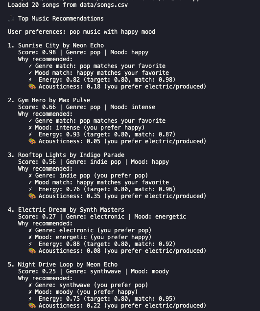
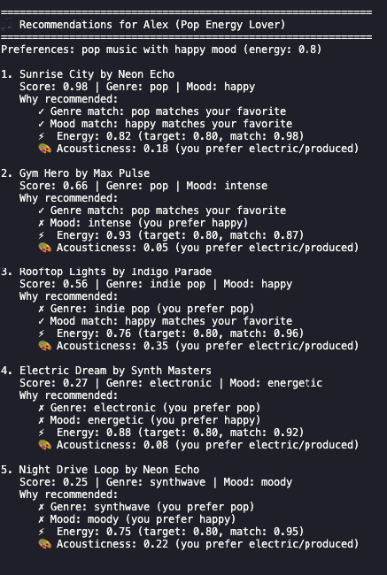
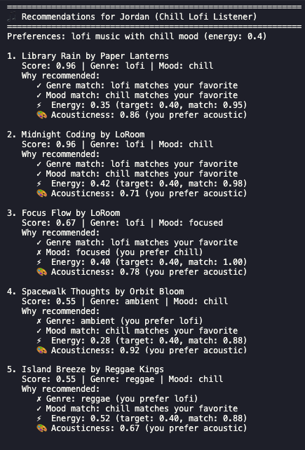
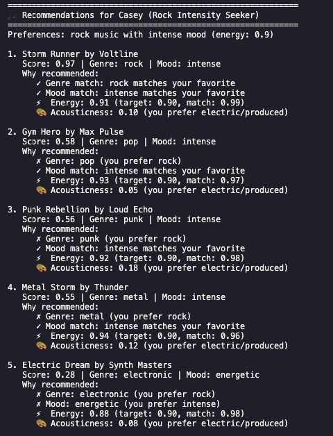

# 🎵 Music Recommender Simulation

## Project Summary

In this project you will build and explain a small music recommender system.

Your goal is to:

- Represent songs and a user "taste profile" as data
- Design a scoring rule that turns that data into recommendations
- Evaluate what your system gets right and wrong
- Reflect on how this mirrors real world AI recommenders

Replace this paragraph with your own summary of what your version does.

---

## How The System Works

- The features I would use in my recommender system would iclude genre, mood, energy, and valence. I think danceability could also be useful for contextualizing the listening experience (workout vs relaxation), but is not as important as the others. Using artist could limit discovery so I don't want it to focus too heavily on that. 
- UserProfile would store liked/disliked songs and listening history, along with the pre-existing info like favorite genre and favorite mood. 
- The Recommender computes a score for each song using cosine similarity, and creates recommendations using a ranking rule (ex. basic sorting).
- Algorithm Recipe: For each song, genre match is weighted 40%, mood match 30%, energy match 25%, and other attributes 10%. This system may over-prioritize genre but this is fine for a new user, and then weight can be adjusted later on. The scores that meet the given threshold will then be ranked by score (sorted descending) and the system would return the top K songs + scores. 

## Demo

---
  

---

## Getting Started

### Setup

1. Create a virtual environment (optional but recommended):

   ```bash
   python -m venv .venv
   source .venv/bin/activate      # Mac or Linux
   .venv\Scripts\activate         # Windows

2. Install dependencies

```bash
pip install -r requirements.txt
```

3. Run the app:

```bash
python -m src.main
```

### Running Tests

Run the starter tests with:

```bash
pytest
```

You can add more tests in `tests/test_recommender.py`.

---

## Model Card

See [**model_card.md**](model_card.md) for the full model card and reflection on the recommender system.

