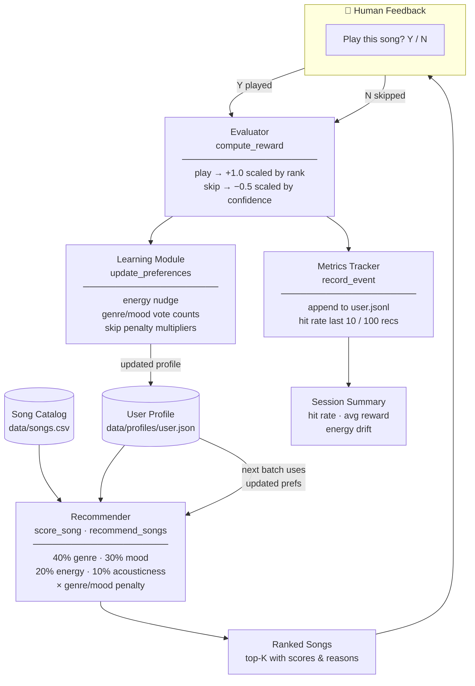

# Music Recommender with RL Feedback Loop

## Original Project (Modules 1–3): Cryosonic 1.0

The original project, **Cryosonic 1.0**, was a static music recommender that scored songs against a fixed user profile using a weighted formula: 40% genre match, 30% mood match, 20% energy proximity, and 10% acousticness. It demonstrated core recommender system concepts — content-based filtering, feature weighting, and explainable scoring — by generating ranked top-K recommendations for three built-in user profiles (Alex, Jordan, and Casey) via a CLI demo. The system had no memory between runs and could not learn from user behavior.

---

## Video Walkthrough

[Watch the demo walkthrough](https://imgur.com/a/lDgU6Zq)

---

## Title and Summary

**Cryosonic 1.0 → Cryosonic RL**: A music recommender that learns from your feedback.

The extended system adds a full reinforcement learning feedback loop on top of the original recommender. After each recommendation, you tell the system whether you want to play or skip the song. That signal is converted into a reward, which immediately updates your taste profile — nudging energy preferences, shifting genre and mood vote counts, and applying score penalties to genres you repeatedly skip. The next batch of recommendations already reflects what was just learned. Over many sessions, the system builds a persistent profile that gets more accurate the more you use it.

This matters because it demonstrates the core mechanism behind real-world recommendation engines like Spotify's Discover Weekly: a model that improves from implicit user signals rather than requiring manual preference tuning.

---

## System Diagram



## Architecture Overview

The system has five components that form a closed feedback loop:

- **Recommender** (`recommender.py`): Scores every song against the current user profile and returns the top-K. Scores use the original weighted formula, multiplied by per-genre and per-mood penalty values that accumulate from skip history.
- **Human Feedback** (`feedback.py`): Displays each song with its score and reasoning, then blocks on a Y/N prompt. This is where the human checks the AI's output and signals whether it was correct.
- **Evaluator** (`evaluator.py`): Converts the Y/N into a reward. A rank-1 play scores +1.0; a skip on a high-confidence recommendation scores as low as −0.75 (the system was confident and wrong — stronger signal).
- **Learning Module** (`learning.py`): Applies the reward to three aspects of the user profile: energy target (continuous nudge), genre/mood preference (vote counting), and genre/mood penalties (15% decay per skip, 10% recovery per play).
- **Metrics Tracker** (`metrics.py`): Appends every event to a JSONL log and reports hit rate over the last 10 and 100 recommendations at session end.

The User Profile is saved to disk after every song, so learning persists across sessions.

---

## Setup Instructions

1. **Clone the repo and create a virtual environment (recommended):**

   ```bash
   python -m venv .venv
   source .venv/bin/activate      # Mac / Linux
   .venv\Scripts\activate         # Windows
   ```

2. **Install dependencies:**

   ```bash
   pip install -r requirements.txt
   ```

3. **Run interactive mode** (feedback loop, learns from your input):

   ```bash
   python -m src.main                   # default user: Alex
   python -m src.main --user jordan     # switch user
   python -m src.main --user casey --k 3  # 3 songs per batch
   ```

4. **Run the original static demo** (no feedback, original 3-user output):

   ```bash
   python -m src.main --demo
   ```

5. **Run tests:**

   ```bash
   pytest
   ```

> User profiles are saved in `data/profiles/` and event logs in `data/metrics/`. Delete a profile JSON to reset that user's learned preferences.

---

## Sample Interactions

### Example 1 — First batch for Alex (fresh profile)

```
Starting session for Alex
Preferences: pop / happy | energy target: 0.80 | acoustic: False

══════════════════════════════════════════════════
  Recommendations for Alex
══════════════════════════════════════════════════

  #1  Sunrise City by Neon Echo
       Score: 0.98  |  Genre: pop  |  Mood: happy  |  Energy: 0.82
  Why recommended:
    ✓ Genre match: pop matches your favorite
    ✓ Mood match: happy matches your favorite
    ⚡ Energy: 0.82 (target: 0.80, match: 0.98)
    🎨 Acousticness: 0.18 (you prefer electric/produced)

  Play this song? (Y/N): Y

  [REWARD] Rank 1 play → reward = +1.00
  [LEARNING] Energy target: 0.80 → 0.81
  [LEARNING] Genre votes: pop(7)
```

---

### Example 2 — Skipping a genre repeatedly, watching it drop in rankings

After Alex skips "Storm Runner" (rock) three times across sessions:

```
  #3  Storm Runner by Voltline
       Score: 0.09  |  Genre: rock  |  Mood: intense  |  Energy: 0.91

  Play this song? (Y/N): N

  [REWARD] Rank 3 skip (score=0.09) → reward = -0.25
  [LEARNING] Genre penalties: rock(0.61)
```

Rock's score went from 0.25 (no penalty) down to 0.09 after three skips (×0.61 multiplier), and it no longer appears in Alex's top-5.

---

### Example 3 — Session summary after 8 songs

```
═══════════════════════════════════════════════════════
  Session Summary — Alex
═══════════════════════════════════════════════════════
  Songs presented : 8
  Played          : 6   Skipped : 2
  Hit rate        : 75.0%
  Avg reward      : +0.61
  Energy target   : 0.80 → 0.83
  Hit rate (last 10)  : 70.0%
═══════════════════════════════════════════════════════
```

---

## Design Decisions

**Binary scoring vs. fuzzy matching.** The original genre and mood scores are still binary (exact match = 1.0, anything else = 0.0). This was kept intentional: the penalty multiplier system handles the "I don't want to see this genre" case without requiring fuzzy logic, which would add significant complexity for a 20-song catalog. The trade-off is that similar genres (rock vs. indie rock) get no partial credit, but this is flagged as a known limitation in the model card.

**Vote counting for genre/mood learning.** Rather than flipping `favorite_genre` on a single play, the system accumulates votes. A new user starts with 5 votes in their default genre; it takes consistent signals to shift the favorite. This prevents noise from a single curious click from overwriting the user's actual taste.

**Skip penalties as multipliers, not filters.** Skipped genres are penalized with a score multiplier (floor: 0.3) rather than being removed from results entirely. This means a repeatedly-skipped genre still appears occasionally — important for discovery and for giving the user a chance to change their mind. Full removal would be too aggressive for a 20-song catalog where the system needs to keep offering variety.

**Persist after every song, not at session end.** The profile is written to disk immediately after each feedback event. A Ctrl+C mid-session doesn't lose any learning progress. The trade-off is a small file I/O cost per song, which is negligible at this scale.

**JSONL for event logs.** Metrics are stored as one JSON object per line (JSONL). Appending a new event is a single file write with no parsing of existing data — safe even if the process crashes. The format is also human-readable without any tooling.

---

## Testing Summary

**17 out of 17 automated tests passed.** Two bugs were caught and fixed before the tests were written; both failures would have been caught by the test suite had tests existed earlier.

Tests are in `tests/test_recommender.py` and cover four areas:

| Area | Tests | What they verify |
|---|---|---|
| `score_song` | 5 | Genre match boosts score; scores stay in [0, 1]; perfect match scores ≥ 0.90; penalty lowers score; penalty is genre-isolated |
| `recommend_songs` | 3 | Returns exactly K songs; sorted descending by score; top result matches user genre |
| `compute_reward` | 4 | Play → positive; skip → negative; rank 1 play > rank 5 play; high-confidence skip penalizes more than low-confidence skip |
| Learning module | 5 | Energy nudges toward played songs and away from skipped; skip penalizes the skipped genre not the current favorite; play recovers penalty; energy stays within [0.05, 0.95] |

Run them with:
```bash
python -m pytest tests/test_recommender.py -v
```

**Confidence scoring:** The recommender's output score (0.0–1.0) functions as a confidence signal. The evaluator already uses it: skipping a song the system was 95% confident about triggers a reward of −0.72, versus −0.30 for skipping a borderline 20% match. Higher-confidence wrong predictions update the model more aggressively.

**What worked well:**

- Energy nudge was correct from the first implementation — continuous, bounded, and immediately visible in output.
- The penalty multiplier system fixed the core problem that binary scoring created: non-favorite genre songs were already at a score floor of 0, so they couldn't be penalized further. Multiplying the *total* score instead of the genre component alone means all songs respond to skips.
- Profile persistence worked reliably across sessions.

**What didn't work (caught by tracing, now covered by tests):**

- `_update_categorical` was subtracting votes from the *current favorite* on skips instead of the *skipped song's genre*. `test_skip_penalizes_skipped_genre_not_current_favorite` directly guards this behavior.
- Without the penalty multiplier, skipping a non-favorite genre had zero effect on future recommendations — the score was already 0 and couldn't go lower. `test_genre_penalty_lowers_score` verifies the fix holds.

**What I learned:**

A feedback loop is only as good as its signal routing. The reward formula was correct, but it didn't matter while the learning module updated the wrong target. The key diagnostic question is: *is what gets worse actually the thing that was skipped?* That question — and a test for it — is what caught both bugs.

---

## Model Card

See [**model_card.md**](model_card.md) for the full model card and reflection on the recommender system.
